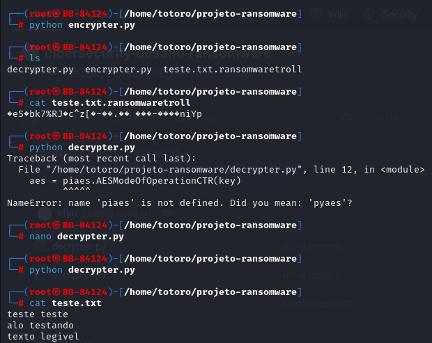

# Ransomware para criptografia de arquivo teste.txt

### Ferramentas

- Kali Linux
- Python

### Estruturando o Ransomware no Kali Linux

- Acesso root: ```sudo su```
- Diretorio criado para os arquivos: ```mkdir projeto-ransomware```
- Codigo utilizado para criptografar: ```encrypter.py```
- Codigo utilizado para descriptgrafar: ```decryter.py```
- Biblioteca utilizada: ```pyaes```
- Chave de 16 bits utilizada para criptografia: ```testeransomware```

### Resultados


